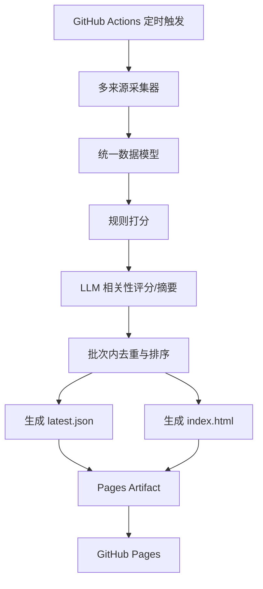

# Daily Paper 网页版实施设计文档

## 1. 目标与范围

本项目的目标是将当前“每日抓取 arXiv 论文并通过邮件推送”的系统，改造成“每日定时抓取多来源论文/期刊文章并发布为 GitHub Pages 静态网页”的系统。

### 1.1 新目标

系统每天自动运行一次，完成以下工作：

1. 抓取当天新发布的论文/文章。
2. 对论文进行规则打分与相关性排序。
3. 使用大模型生成中文摘要与简短点评。
4. 生成一个只展示当天结果的静态网页。
5. 自动部署到 GitHub Pages。

### 1.2 明确不做的事情

1. 不再发送邮件。
2. 不做在线实时抓取。
3. 不保存跨天历史，不做历史归档页面。
4. 不维护“已发送历史”去重文件。
5. 不在网页中全文转载闭源论文摘要，优先展示系统生成的摘要、评分、标签与原文链接。

---

## 2. 现状与可复用内容

当前仓库主逻辑位于 [fetch_papers.py](/C:/codex_workspace/dailyPaper/fetch_papers.py)。

现有逻辑可复用部分：

1. arXiv 抓取主流程。
2. 规则打分函数 `calculate_paper_quality_score()`。
3. 标题相似度去重逻辑。
4. 调用 DeepSeek 生成摘要的方式。
5. HTML 卡片式展示思路。

现有逻辑需要删除或替换部分：

1. `send_email()` 邮件发送逻辑。
2. `load_sent_history()` / `save_sent_history()` 跨天历史记忆。
3. 与邮件主题、SMTP、收件人相关的环境变量。
4. 现有 workflow 中“运行后发邮件”的步骤。

---

## 3. 总体架构

建议采用“离线构建 + 静态部署”的架构：

1. GitHub Actions 每天定时运行。
2. 在 Action 中抓取各来源当天内容。
3. 将不同来源的数据统一成同一种结构。
4. 完成评分、排序、去重、摘要生成。
5. 输出静态页面与 JSON 数据文件。
6. 使用 GitHub Pages 官方部署 Action 发布站点。

### 3.1 架构图



### 3.2 为什么采用这个架构

1. GitHub Pages 本身只适合静态展示，不适合浏览器端直接抓取期刊网站。
2. 多期刊抓取对网络、反爬、解析稳定性要求较高，更适合在 GitHub Actions 后台执行。
3. 每天只更新一次页面，天然适合“定时构建静态站点”。
4. 不保存历史时，站点只维护一份最新结果，部署逻辑更简单。

---

## 4. 推荐目录结构

建议将当前单文件脚本拆分为以下结构：

```text
dailyPaper/
├─ .github/
│  └─ workflows/
│     └─ build_daily_site.yml
├─ collectors/
│  ├─ __init__.py
│  ├─ arxiv.py
│  ├─ nature.py
│  ├─ joule.py
│  ├─ ieee.py
│  └─ common.py
├─ pipeline/
│  ├─ __init__.py
│  ├─ models.py
│  ├─ normalize.py
│  ├─ score.py
│  ├─ summarize.py
│  ├─ dedupe.py
│  └─ render.py
├─ templates/
│  └─ index.html
├─ site/
│  ├─ index.html
│  └─ latest.json
├─ scripts/
│  └─ build_daily_site.py
├─ requirements.txt
└─ README.md
```

### 4.1 各目录职责

`collectors/`

负责和各数据源交互。每个来源一个 collector，避免以后某个来源失效时牵连整条主链路。

`pipeline/`

负责统一数据结构、打分、摘要、去重、排序和渲染。

`templates/`

负责 HTML 模板，不掺杂抓取逻辑。

`site/`

最终产物目录，GitHub Pages 部署这个目录。

`scripts/`

放总入口脚本，供本地调试和 GitHub Actions 调用。

---

## 5. 统一数据模型设计

不同来源的数据字段差异很大，因此必须先做统一建模。

建议定义一个统一对象 `PaperRecord`。

### 5.1 字段建议

```python
{
    "id": "source-specific-stable-id",
    "source": "arxiv | nature | joule | ieee",
    "journal": "IEEE Transactions on Smart Grid",
    "title": "...",
    "authors": ["A", "B", "C"],
    "abstract_raw": "...",
    "url": "...",
    "pdf_url": "...",
    "doi": "...",
    "published_date": "2026-03-20",
    "published_datetime": "2026-03-20T08:15:00+00:00",
    "categories": ["energy", "optimization"],
    "metadata": {
        "issn": "...",
        "issue": "...",
        "volume": "...",
        "publisher": "..."
    },
    "rule_score": 0.0,
    "llm_score": 0.0,
    "final_score": 0.0,
    "score_reason": "...",
    "ai_summary": "...",
    "relevance_label": "强相关 | 弱相关 | 不相关"
}
```

### 5.2 设计原则

1. 所有来源最后都必须输出同一结构。
2. 页面层不要知道不同来源的细节。
3. 打分、渲染、去重都只依赖统一结构。

---

## 6. 数据源采集设计

核心原则：

1. 只抓当天新内容。
2. 优先使用稳定、结构化的数据源。
3. 摘要优先从公开 metadata 或落地页提取。
4. 如果拿不到摘要，则记录为“摘要缺失”，不直接让该来源阻塞整次构建。

### 6.1 arXiv

实现方式：

1. 继续使用现有 `arxiv` Python 包。
2. 按分类抓取最近论文。
3. 依据 `published` 时间过滤到当天窗口。

建议保留：

1. 当前的分类配置。
2. 标题去重。
3. 规则打分中的关键词逻辑。

需要调整：

1. 删除历史文件过滤。
2. 将结果输出为统一 `PaperRecord`。

### 6.2 Nature 系列

目标期刊示例：

1. Nature Energy
2. Nature Communications

推荐策略：

1. 优先使用期刊文章列表页或 RSS 拿当天文章链接。
2. 再请求文章落地页，提取标题、作者、发布日期、摘要。
3. 如网站结构变化，保底可退回 Crossref 获取 metadata。

注意点：

1. Nature 页面结构相对规整，但前端组件较多，解析时建议尽量依赖页面中的结构化 metadata。
2. 日期应优先使用 online publication date。

### 6.3 Joule

推荐策略：

1. 优先使用期刊列表页或摘要页链接。
2. 抓取 article abstract page 中的标题、作者、发布日期和摘要。
3. 如直接页面解析不稳定，则用 Crossref 辅助拿 DOI 和日期，再根据 DOI 或 landing page 补摘要。

注意点：

1. Elsevier 页面可能包含较多脚本和动态内容。
2. 必须设计失败降级逻辑。

### 6.4 IEEE 三个期刊

目标期刊：

1. IEEE Transactions on Smart Grid
2. IEEE Transactions on Power Systems
3. IEEE Transactions on Sustainable Energy

建议策略分两层：

第一层：元数据层

1. 用期刊 ISSN 或期刊名从 Crossref 查询当天在线发布文章。
2. 获取 DOI、标题、作者、日期、期刊名、URL。

第二层：摘要补全层

1. 尝试从 DOI 或 IEEE Xplore 落地页提取摘要。
2. 若摘要缺失，则保留元数据但降低优先级，或者标记为“待补摘要”。

注意点：

1. IEEE 这部分是全项目最脆弱的数据源。
2. 不建议第一阶段就把 IEEE 抓取做成强依赖。
3. 推荐先把 IEEE 放到“可失败但不影响整体发布”的模式。

### 6.5 数据源优先级

建议实施顺序：

1. arXiv
2. Nature Energy / Nature Communications
3. Joule
4. IEEE 三刊

原因：

1. 先用稳定源把整体链路打通。
2. 先交付 Pages 站点，再逐步扩展来源。

---

## 7. 时间窗口设计

你当前需求是不保存历史，只看当天结果。因此时间窗口设计非常关键。

### 7.1 推荐规则

1. Action 每天固定时刻运行一次。
2. 每个来源只保留“发布日期是当天”的文章。
3. 期刊优先使用 online published date。
4. arXiv 使用 published datetime。

### 7.2 时区建议

统一规则：

1. 系统内部全部转换成 UTC 或带时区的 datetime。
2. 页面显示使用北京时间。
3. workflow 运行时间按北京时间需求换算为 UTC cron。

### 7.3 边界问题

需要在实现里明确以下情况：

1. 某些期刊数据源只提供日期，不提供时分秒。
2. 某些来源在不同时区更新。
3. 某些文章“今天上线，但 issue date 是旧日期”。

建议处理方式：

1. 若有 online date，则优先 online date。
2. 若只有 date，则按当天自然日比较。
3. 若完全无有效日期，则默认丢弃，不纳入当天榜单。

---

## 8. 打分与排序设计

推荐将现有评分逻辑升级为“两阶段评分”。

### 8.1 第一阶段：规则分 `rule_score`

可直接基于现有 `calculate_paper_quality_score()` 改造。

建议纳入的因素：

1. 标题关键词。
2. 摘要关键词。
3. 摘要长度。
4. 作者数量。
5. 期刊权重。
6. 是否明确与能源系统、电力系统、优化、learning for optimization 等主题相关。

示例权重：

1. 标题命中核心关键词：`+1.0 ~ +2.0`
2. 摘要命中核心关键词：`+0.3 ~ +1.0`
3. 摘要过短：`-1.0 ~ -2.0`
4. 高优先期刊加权：`+0.5 ~ +1.5`

### 8.2 第二阶段：模型分 `llm_score`

对每篇论文让模型回答两件事：

1. 与目标研究方向的相关性评分，例如 `0-10`
2. 一句话评分理由

建议 prompt 输出结构化 JSON：

```json
{
  "relevance_score": 8.5,
  "relevance_label": "强相关",
  "reason": "聚焦电力系统运行优化与数据驱动决策"
}
```

### 8.3 最终分

建议公式：

```text
final_score = 0.45 * rule_score + 0.55 * llm_score
```

也可以先简化为：

1. 用规则分做初筛。
2. 只对 Top N 调模型。
3. 最终按模型分或加权总分排序。

### 8.4 为什么这样做

1. 降低 LLM 调用成本。
2. 提高排序稳定性。
3. 对摘要缺失、结构异常的文章更稳健。

---

## 9. 去重策略

因为不保存历史，所以只做“当天批次内去重”。

### 9.1 去重维度

1. DOI 相同，直接视为重复。
2. URL 相同，直接视为重复。
3. 标题相似度高于阈值，视为重复。

### 9.2 推荐规则

1. 先按 DOI 去重。
2. 再按 title normalized similarity 去重。
3. 重复项保留 `final_score` 更高的记录。

### 9.3 为什么必须保留去重

因为同一篇工作可能会以：

1. 期刊落地页链接
2. DOI 链接
3. 不同 metadata 端点

重复出现。

---

## 10. 摘要生成策略

### 10.1 目标

对用户来说，页面上最有价值的是“能快速判断是否值得精读”的摘要，而不是原始 abstract 的复述。

### 10.2 每篇文章建议生成

1. 中文摘要
2. 一句话应用价值
3. 相关性标签
4. 评分理由

### 10.3 推荐 prompt 输出

```json
{
  "summary_zh": "...",
  "application_value": "...",
  "relevance_label": "强相关",
  "reason": "..."
}
```

### 10.4 调用策略

建议采用两层：

1. 所有候选先做规则分。
2. 只对排序后的前 10 到 20 篇调大模型。

这样更省 API 成本，也更稳定。

---

## 11. 页面设计

页面目标不是做成论文数据库，而是做成“每日精选看板”。

### 11.1 页面组成

顶部区域：

1. 页面标题
2. 今日日期
3. 最后更新时间
4. 数据来源说明

筛选区域：

1. 按来源筛选
2. 按期刊筛选
3. 按相关性标签筛选
4. 按得分排序

内容区域：

每篇论文一张卡片，包含：

1. 标题
2. 来源/期刊
3. 发布时间
4. 作者
5. 分数
6. 相关性标签
7. AI 摘要
8. 一句话价值
9. 原文链接

页脚区域：

1. 生成方式说明
2. 数据来源声明

### 11.2 页面实现方式

推荐两种实现方式中的第一种：

方案 A：纯静态 HTML 模板渲染

1. Python 读取模板。
2. 直接将数据渲染到 HTML。
3. 输出单页 `site/index.html`。

方案 B：静态 HTML + `latest.json`

1. 页面框架写死。
2. 浏览器端读取 `latest.json` 并渲染。

推荐选择：

方案 B。

原因：

1. 前后端职责更清晰。
2. 页面后续样式修改更方便。
3. 数据和模板分离，便于调试。

---

## 12. GitHub Actions 设计

建议新增一个 workflow，例如：

`build_daily_site.yml`

### 12.1 主要步骤

1. checkout 代码
2. setup Python
3. install dependencies
4. run `python scripts/build_daily_site.py`
5. upload Pages artifact
6. deploy Pages

### 12.2 推荐权限

如果使用 GitHub Pages 官方部署 Action，workflow 需要：

```yaml
permissions:
  contents: read
  pages: write
  id-token: write
```

### 12.3 推荐环境变量

保留：

1. `DEEPSEEK_API_KEY`

新增可选：

1. `EMAIL_LANGUAGE` 可以改名为 `SITE_LANGUAGE`
2. `TARGET_TIMEZONE=Asia/Shanghai`

删除：

1. `SENDER_EMAIL`
2. `SENDER_PASSWORD`
3. `RECEIVER_EMAIL`
4. `SMTP_SERVER`
5. `SMTP_PORT`

### 12.4 运行输出

运行后输出：

1. `site/index.html`
2. `site/latest.json`

站点部署后，GitHub Pages 直接展示 `site/` 的内容。

---

## 13. GitHub 权限与配置说明

### 13.1 是否需要开 GitHub 权限

需要，但通常不需要单独申请个人访问令牌。

需要开启的内容：

1. 仓库的 GitHub Actions
2. 仓库的 GitHub Pages

如果采用官方 Pages 部署方式，一般只依赖 GitHub 自动提供的 `GITHUB_TOKEN`。

### 13.2 是否需要每天向仓库写 commit

不需要，推荐不要这样做。

推荐方式：

1. 每天 Action 构建页面产物。
2. 将产物上传为 Pages artifact。
3. 直接部署到 GitHub Pages。

这样不会产生每日 commit 噪音，也不需要维护 `gh-pages` 分支历史。

### 13.3 什么时候才需要更高权限

只有在以下情况下才可能需要更高权限：

1. 你坚持把生成结果 commit 回仓库。
2. 你要从私有外部服务拉取额外资源。
3. 你使用需要认证的第三方 API。

对于当前方案，不建议这么做。

---

## 14. 依赖与环境设计

### 14.1 现有依赖

当前 [requirements.txt](/C:/codex_workspace/dailyPaper/requirements.txt) 只有：

1. `arxiv`
2. `openai`

### 14.2 建议新增依赖

```text
requests
beautifulsoup4
lxml
jinja2
python-dateutil
feedparser
```

可选：

```text
pydantic
tenacity
```

### 14.3 建议用途

1. `requests`：抓取网页和 API
2. `beautifulsoup4` / `lxml`：解析 HTML
3. `jinja2`：渲染页面模板
4. `python-dateutil`：处理复杂日期格式
5. `feedparser`：处理 RSS
6. `tenacity`：网络请求重试

---

## 15. 错误处理与降级策略

多来源抓取系统必须允许部分来源失败。

### 15.1 推荐原则

1. 单个来源失败，不影响整体发布。
2. 单篇文章摘要生成失败，不影响整页生成。
3. 记录错误日志并输出到 Actions 日志。

### 15.2 具体策略

1. `collector` 级别捕获异常。
2. 对每个来源记录成功数、失败数。
3. 摘要失败时显示“摘要生成失败，请查看原文”。
4. 若当天完全无内容，页面也正常发布，只显示“今日未发现符合条件的新论文”。

---

## 16. 实施阶段建议

建议分四个阶段执行。

### 阶段一：邮件版改网页版

目标：

1. 保留 arXiv。
2. 去掉邮件和历史文件。
3. 输出 `site/index.html` 和 `site/latest.json`。
4. 用 GitHub Pages 发布。

验收标准：

1. 每天 Action 能跑通。
2. 页面能显示当天 arXiv 排序结果。

### 阶段二：接入 Nature 与 Joule

目标：

1. 增加 Nature Energy、Nature Communications、Joule。
2. 完成统一数据建模。
3. 页面可按来源筛选。

验收标准：

1. 新来源不影响 arXiv 链路。
2. 页面可展示多来源数据。

### 阶段三：接入 IEEE 三刊

目标：

1. 接入 IEEE TSG、TPWRS、TSE。
2. 使用 metadata + 摘要补全双层策略。

验收标准：

1. IEEE 来源失败时不影响站点发布。
2. 有摘要的 IEEE 条目可正常排序显示。

### 阶段四：优化评分与页面体验

目标：

1. 优化 prompt 与评分体系。
2. 增加筛选、标签、统计信息。
3. 调整样式和可读性。

---

## 17. 风险与对应措施

### 风险 1：期刊页面结构变化

影响：

抓取器失效。

措施：

1. 每个来源独立实现。
2. 优先依赖稳定 metadata。
3. 保留失败降级策略。

### 风险 2：IEEE 摘要难以稳定抓取

影响：

IEEE 来源不稳定。

措施：

1. 将 IEEE 设为非阻塞来源。
2. 先抓 metadata，再补摘要。
3. 第一阶段不把 IEEE 作为核心依赖。

### 风险 3：LLM 成本和速度

影响：

每日任务耗时上升。

措施：

1. 先规则打分，再摘要 Top N。
2. 将 LLM 用于精选结果，而不是所有抓到的文章。

### 风险 4：闭源期刊版权边界

影响：

直接转载摘要存在风险。

措施：

1. 页面优先展示系统生成的中文摘要。
2. 原始摘要仅作为内部评分与生成输入。
3. 页面保留原文链接，不在站点中大段复现原摘要。

---

## 18. MVP 建议

如果以最小可用版本为目标，建议 MVP 只做：

1. 保留 arXiv 抓取。
2. 去掉邮件。
3. 增加 `site/index.html` 和 `site/latest.json` 输出。
4. 增加 GitHub Pages 自动部署。
5. 页面展示当天 Top 10。

MVP 跑通后，再逐步接入期刊。

---

## 19. 与当前代码的对应关系

当前文件 [fetch_papers.py](/C:/codex_workspace/dailyPaper/fetch_papers.py) 可拆分如下：

1. `calculate_paper_quality_score()` -> `pipeline/score.py`
2. `calculate_title_similarity()` / `remove_duplicate_papers()` -> `pipeline/dedupe.py`
3. `summarize_paper()` -> `pipeline/summarize.py`
4. `get_latest_papers()` 中 arXiv 部分 -> `collectors/arxiv.py`
5. `generate_email_content()` -> 拆成 `pipeline/render.py` + `templates/index.html`
6. `send_email()` -> 删除
7. `load_sent_history()` / `save_sent_history()` -> 删除
8. `main()` -> `scripts/build_daily_site.py`

---

## 20. 最终建议

本项目最合理的路线不是“在现有脚本上继续堆功能”，而是：

1. 先把单文件脚本拆成多模块。
2. 先完成 GitHub Pages 化。
3. 再分来源逐步扩展抓取器。

建议实际执行顺序：

1. 先完成阶段一，保证网页版先上线。
2. 再接 Nature 与 Joule。
3. 最后再攻 IEEE。

如果按这个方案实施，系统会从“单一数据源邮件脚本”升级成“多来源每日论文精选静态站点”，同时保持结构清晰、容易维护、适合逐步演进。
